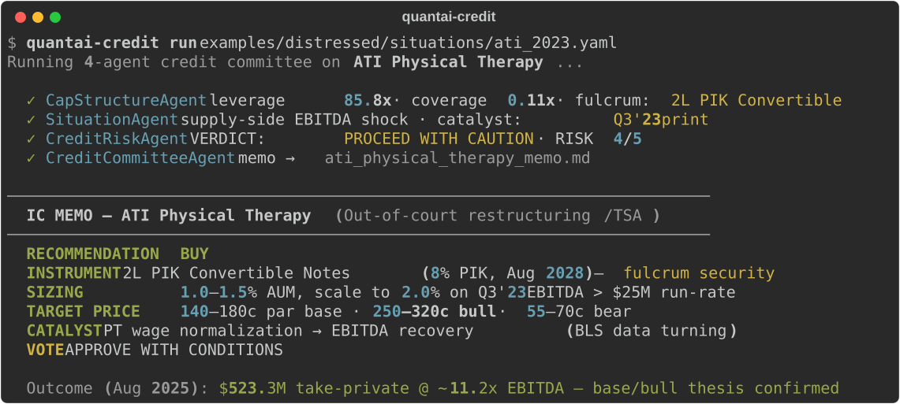

# QuantAI — An AI Distressed-Credit Committee

[](https://github.com/RahulModugula/quantai-dashboard/actions/workflows/ci.yml)
[](https://www.python.org/downloads/release/python-3110/)
[](LICENSE)
[](https://github.com/BerriAI/litellm)
[](tests/)

> **Four AI agents debate a distressed-credit situation — leverage, recovery waterfall, fulcrum security, tail risks — and write the IC vote memo.**
> Point it at any deal in a YAML file. The same agent architecture also drives an equity-research pipeline; credit is the wedge.

<p align="center">
  
</p>

---

## Quick Demo (no API key required)

```bash
git clone https://github.com/RahulModugula/quantai-dashboard.git
cd quantai-dashboard
python -m examples.distressed.demo
```

This prints a full 4-agent credit committee memo on **ATI Physical Therapy's April 2023 Transaction Support Agreement** — an out-of-court loan-to-own restructuring. It needs no API key, no install, and no data: just the Python standard library. It's the bundled worked example; the next section shows how to run the committee on *your own* situation.

> The ATI case is real and analyzed at the **April 2023 entry point**, not in hindsight. The position closed as a **$523.3M take-private in August 2025 (~11.2x LTM Adj EBITDA)** — the committee's base/bull thesis was confirmed. See [docs/ARCHITECTURE.md](docs/ARCHITECTURE.md) for the full breakdown and design notes.

---

## Run it on your own deal

The credit committee isn't hardcoded to ATI — point it at any distressed
situation described in a YAML file and it writes the IC memo:

```bash
quantai-credit new my_deal.yaml     # scaffold an annotated template
# ...fill in the cap structure, timeline, metrics, and risks...
quantai-credit run my_deal.yaml     # 4-agent committee → my_deal_memo.md
quantai-credit list                 # show bundled example situations
```

A situation file is just the cap stack, a timeline, operating metrics, and the
risks you already see — no code. The committee computes leverage, coverage, the
recovery waterfall, and the fulcrum security from the numbers you give it, then
debates and votes. Start from [`TEMPLATE.yaml`](examples/distressed/situations/TEMPLATE.yaml)
(annotated blank) or copy one of the bundled examples:

| Situation | Structure it teaches |
|-----------|---------------------|
| [`ati_2023.yaml`](examples/distressed/situations/ati_2023.yaml) | Loan-to-own via a 2L PIK convertible fulcrum (out-of-court TSA) |
| [`serta_2020.yaml`](examples/distressed/situations/serta_2020.yaml) | Non-pro-rata **uptier** / liability management — inside vs. outside the majority |
| [`hertz_2020.yaml`](examples/distressed/situations/hertz_2020.yaml) | **Asset-coverage** with a bankruptcy-remote fleet-ABS silo (Chapter 11) |

Each is sourced from public filings, with approximate figures marked inline. Adding another is pure YAML — a great [first contribution](CONTRIBUTING.md).

> No LLM key? `python -m examples.distressed.demo` shows a complete sample memo
> with zero setup. To run live on your own file, set any LiteLLM-supported key
> (`ANTHROPIC_API_KEY`, `OPENAI_API_KEY`, `OPENROUTER_API_KEY`) or point
> `QUANTAI_AGENT_MODEL=ollama/llama3` at a local model for zero cost.

---

## What This Is

**The core: an AI distressed-credit committee** (`examples/distressed/`). Four agents debate a restructuring situation and write an IC-style vote memo. They call deterministic Python tools — the math doesn't vary by temperature — and hand structured briefs to each other:

- **CapStructureAgent** — leverage, coverage, fulcrum security, recovery waterfall (base/bear/bull)
- **SituationAgent** — docket/timeline events, upcoming catalysts, structural vs. noise, information gaps
- **CreditRiskAgent** — devil's advocate: stresses every assumption, enumerates tail and process risks
- **CreditCommitteeAgent** — writes the vote memo: instrument, sizing, target, catalyst, downside, conditions

You describe a situation in a YAML file — cap stack, timeline, operating metrics, known risks — and run `quantai-credit run`. No code. There is no comparable open-source tool for AI-assisted distressed-credit / restructuring analysis; everything else in this space targets equities.

**The same architecture also drives an equity-research pipeline** (`src/`) — `QuantAgent → NewsAgent → RiskAgent → PortfolioManager`, backed by a walk-forward ML ensemble (RF + XGB + LightGBM + LSTM, no lookahead bias), SHAP explainability, backtesting, a FastAPI service, and a Plotly Dash dashboard. It's a second proof that the agent loop is asset-class-agnostic, and a fuller "batteries-included" trading playground if you want it.

Both share a single `BaseAgent` class (`src/agents/base_agent.py`). Moving to a new asset class means writing a subclass and a tool module — not touching shared infrastructure. See [docs/ARCHITECTURE.md](docs/ARCHITECTURE.md).

---

## Why the ATI Case Study Matters

The demo is not a textbook example — it's a validated real-world trade:

| | |
|--|--|
| **Entry** | April 11, 2023 — Transaction Support Agreement; 2L PIK convertible, loan-to-own |
| **Thesis** | PT wage normalization → EBITDA recovery → fulcrum equity conversion |
| **Instrument** | New 2L PIK Convertible: $125M face, 8% PIK, Aug 2028 maturity |
| **System vote** | BUY — APPROVE WITH CONDITIONS, 1.0–1.5% AUM |
| **Outcome** | Aug 1, 2025: $523.3M TEV take-private at ~11.2x LTM Adj EBITDA |
| **Thesis result** | Base confirmed. Bull confirmed. |

The system analyzed this at the decision point, not in hindsight. The capital structure, operating metrics, and timeline events are all sourced from public filings (ATI 10-K FY2022, 10-Q Q1 2023, 8-K 04/21/2023).

---

## System Overview

```
                        ┌─────────────────────────────────────┐
                        │         QuantAI Intel Layer          │
                        │                                      │
  yfinance news ──────► │  QuantAgent   NewsAgent              │
  SEC EDGAR ──────────► │       │           │                  │
  ML Predictions ─────► │       └─────┬─────┘                 │
                        │         RiskAgent                    │
                        │             │                        │
                        │     PortfolioManagerAgent            │
                        │     BUY / SELL / HOLD + reasoning    │
                        └──────────────┬──────────────────────┘
                                       │
yfinance + VIX/TNX                     ▼
     │              ┌──────────────────────────────────┐
     ▼              │  FastAPI  /api/*                  │
ingestion.py        │  • /agents/analyze/{ticker}       │
     │              │  • /agents/debate/{ticker}        │
     ▼              │  • /predictions, /portfolio       │
features.py ──────► │  • /backtest, /optimizer         │
     │              │  • /regime, /stress-test, /shap  │
     ▼              └──────────────┬───────────────────┘
walk_forward_train()               │
     │                             ▼
EnsembleModel              Plotly Dash /dashboard
RF+XGB+LGB+LSTM            ┌─────────────────────┐
     │                     │ Live Trading         │
     ▼                     │ Portfolio            │
BacktestEngine             │ Backtesting          │
Monte Carlo CI             │ AI Reasoning         │
     │                     │ Explainability (SHAP)│
     ▼                     │ Optimizer            │
PaperTrader loop           │ Advisor + SIP        │
Half-Kelly sizing          └─────────────────────┘
```

---

## Stack

| Layer | Technology |
|-------|-----------|
| Data | yfinance, pandas, SQLite (SQLAlchemy + Alembic) |
| ML | scikit-learn, XGBoost, LightGBM, PyTorch (LSTM), Optuna, SHAP |
| **AI Agents** | **LiteLLM, multi-agent debate, SEC EDGAR + news tool use** |
| Credit Tools | Pure Python dataclasses, deterministic, unit-tested |
| Portfolio | PyPortfolioOpt (efficient frontier, HRP, min-vol) |
| API | FastAPI, WebSocket, Prometheus metrics |
| Dashboard | Plotly Dash (8 tabs, mounted via WSGIMiddleware) |
| Cache | Redis |
| Observability | structlog, Prometheus, health checks |
| CI/CD | GitHub Actions, ruff, pre-commit — green on every push |
| Infra | Docker Compose (dev + prod multi-stage, Nginx) |

---

## Install

### Just the credit committee (lightweight)

The committee runs on **two dependencies** — no ML stack, no torch, no dashboard:

```bash
pip install -r requirements-credit.txt          # litellm + pyyaml only
python -m examples.distressed.run list           # see bundled situations
python -m examples.distressed.run run examples/distressed/situations/ati_2023.yaml
```

Install the package to get the `quantai-credit` command on your PATH:

```bash
pip install -e .          # adds the `quantai-credit` entry point
quantai-credit new my_deal.yaml
```

### The full system (equity pipeline + API + dashboard)

This pulls the ML/data stack (torch, scikit-learn, xgboost, ...) and is only needed for the equity trading playground:

```bash
# Docker (no local setup)
docker compose up --build
```

```bash
# Local
uv venv .venv --python 3.11 && source .venv/bin/activate
make setup      # install all dependencies
make seed       # download 5y of OHLCV + build features
make train      # walk-forward ensemble training (~5 min)
make run        # start at http://localhost:8000
```

| Endpoint | URL |
|----------|-----|
| Dashboard | http://localhost:8000/dashboard |
| API docs | http://localhost:8000/api/docs |
| Health | http://localhost:8000/api/health |
| Metrics | http://localhost:8000/api/metrics/prometheus |

---

## QuantAI Intel — Multi-Agent AI Reasoning

Each analysis run goes through a structured debate between four LLM agents that produce a human-readable memo — BUY / SELL / HOLD with confidence and reasoning — stored in SQLite and surfaced in the **"AI Reasoning"** dashboard tab.

### The Four Agents

| Agent | Role | Tools |
|-------|------|-------|
| **QuantAgent** | Reads the ML ensemble prediction, top SHAP features, and technical indicator snapshot | `get_ml_prediction`, `get_shap_importance`, `get_technical_signals` |
| **NewsAgent** | Fetches recent headlines and SEC EDGAR 8-K/10-Q filings via tool use | `get_recent_news`, `get_sec_filings` |
| **RiskAgent** | Devil's advocate — challenges both analysts, raises tail risks, issues AGREE/CAUTION/DISAGREE verdict | *(reads prior briefs)* |
| **PortfolioManagerAgent** | Weighs all three briefs against current position, issues final BUY/SELL/HOLD with confidence and reasoning | *(reads all briefs)* |

### How the Debate Works

```
Step 1  QuantAgent + NewsAgent run in parallel
           ↓                  ↓
        Quant Brief       Research Brief
           └──────────┬──────────┘
Step 2            RiskAgent
              challenges both
                    ↓
                Risk Brief
           ┌────────┴──────────────┐
Step 3  PortfolioManagerAgent
        final BUY / SELL / HOLD
        + confidence + reasoning
                    ↓
          Stored in SQLite
          Shown in dashboard
```

### Setup

```bash
# .env — set one of these:
OPENROUTER_API_KEY=sk-or-...            # OpenRouter (recommended — model-agnostic)
# ANTHROPIC_API_KEY=sk-ant-...          # Claude direct
# QUANTAI_AGENT_MODEL=ollama/llama3     # Local, no key needed

# Recommended models (all support tool use):
# openrouter/x-ai/grok-4.20            — $2/$6 per M tokens, 2M context (default)
# openrouter/anthropic/claude-opus-4-7  — $5/$25 per M, best reasoning
# openrouter/nvidia/nemotron-3-super-120b-a12b:free  — free tier for dev
```

### API

```bash
curl -X POST http://localhost:8000/api/agents/analyze/AAPL   # trigger analysis
curl http://localhost:8000/api/agents/debate/AAPL            # full transcript
curl http://localhost:8000/api/agents/decision/AAPL          # latest decision
curl http://localhost:8000/api/agents/accuracy               # historical win rate
```

---

## Distressed Credit Extension

The four agents are orchestrated over a data-agnostic `context: dict` — nothing is hard-coded to equities. Swap the system prompts, swap the tool bindings, and the same loop becomes a credit committee.

`examples/distressed/` contains the full worked example on ATI Physical Therapy's April 2023 TSA — an out-of-court exchange offer in which HPS-led lenders converted $100M of the 1L term loan into a new 2L PIK Convertible with equity conversion rights, giving TSA participants a loan-to-own position.

| Equity agent | Credit agent |
|--------------|--------------|
| QuantAgent | CapStructureAgent — leverage, coverage, recovery per tranche, fulcrum |
| NewsAgent | SituationAgent — timeline, catalysts, information gaps |
| RiskAgent | CreditRiskAgent — covenant headroom, tail risks, devil's advocate |
| PortfolioManagerAgent | CreditCommitteeAgent — IC-style memo: thesis, sizing, catalysts, exit |

Pre-rendered sample memo: [`examples/distressed/ati_2023_memo.md`](examples/distressed/ati_2023_memo.md). The decision point analyzed is April 11, 2023 — not the August 2025 take-private, which is the *outcome* of that decision (TEV $523.3M, ~11.2x LTM Adj EBITDA).

---

## ML Pipeline

### Ensemble

| Model | Weight | Contribution |
|-------|--------|-------------|
| Random Forest | 0.30 | Bootstrap diversity, non-linear interactions |
| XGBoost | 0.30 | Gradient boosting, strong on tabular patterns |
| LightGBM | 0.25 | Leaf-wise splits, fast quarterly retraining |
| LSTM | 0.15 | Temporal sequence context |

### Walk-Forward Training

Predictions at time `t` use only data before `t`. Features are joined strictly by date — enforced at the DataFrame merge step, not by convention.

```
┌────────────────────────────────────────────────────────────┐
│  Fold 1: Train [0, 252) → Predict [252, 315)               │
│  Fold 2: Train [0, 315) → Predict [315, 378)               │
│  Fold 3: Train [0, 378) → Predict [378, 441)               │
│  ...expanding window, retrain every 63 trading days...     │
└────────────────────────────────────────────────────────────┘
```

### Features (39)

RSI-14, MACD, Bollinger Bands (%, bandwidth), ATR-14, Stochastic (K, D), ADX-14, SMA50/SMA200 ratios, return lags (1/2/3/5d), volatility (5/20d), momentum (5/20d), mean reversion (20d), volume ratio, OBV, OBV z-score, VIX, Treasury yield.

---

## Backtesting

- Walk-forward validation — realistic OOS performance, no in-sample bias
- Slippage models — participation-rate and square-root market impact
- Monte Carlo confidence intervals — block bootstrap (preserves autocorrelation)
- Benchmark comparison — all metrics vs SPY
- Risk metrics — Sharpe, Sortino, Calmar, max drawdown, win rate, profit factor
- Scenario stress tests — GFC, dotcom, COVID crash, 2022 rate hikes, flash crash
- CSV export — full trade log downloadable

---

## Dashboard Tabs

| Tab | What You Get |
|-----|-------------|
| **Live Trading** | Real-time candlestick, ML signal overlay, live trade log |
| **Portfolio** | Equity curve, drawdown chart, cumulative returns |
| **Backtesting** | Run backtest, view metrics, export trades |
| **AI Reasoning** | Multi-agent debate, final decision, historical accuracy |
| **Explainability** | SHAP feature importance (top-15 bar + per-model breakdown) |
| **Optimizer** | Efficient frontier, HRP, min-vol weights |
| **Advisor** | Risk profiling questionnaire + allocation recommendation |
| **SIP Calculator** | Forward projection + reverse (goal → monthly amount) |

---

## API Reference

<details>
<summary>All endpoints</summary>

**Agent Intel**
```
POST /api/agents/analyze/{ticker}     trigger async analysis
GET  /api/agents/status/{id}          poll progress
GET  /api/agents/debate/{ticker}      full 4-agent transcript
GET  /api/agents/decision/{ticker}    latest decision
GET  /api/agents/history/{ticker}     decision history
GET  /api/agents/accuracy             win rate across all decisions
```

**Predictions & Signals**
```
GET /api/predictions/{ticker}         next-day ML probability + signal
GET /api/signals/latest/{ticker}      signal with strength
GET /api/signals/consensus            cross-ticker consensus
```

**Portfolio**
```
GET /api/portfolio                    positions, cash, total value
GET /api/portfolio/history            equity curve
GET /api/portfolio/trades             trade log
GET /api/portfolio/correlation        correlation matrix
```

**Backtesting**
```
POST /api/backtest/run                async trigger
GET  /api/backtest/result/{key}       retrieve cached result
GET  /api/backtest/export/{key}/trades  CSV download
```

**Analysis**
```
GET /api/shap/importance/{ticker}     SHAP feature importance
GET /api/regime/{ticker}              current market regime
GET /api/regime/{ticker}/history      252-day regime history
GET /api/stress-test/monte-carlo/{ticker}
GET /api/stress-test/scenarios/{ticker}
GET /api/analysis/sector-composition
GET /api/analysis/performance-summary
```

**Optimizer & Advisor**
```
POST /api/optimizer/portfolio         max-Sharpe / min-vol / HRP weights
POST /api/optimizer/frontier          efficient frontier
POST /api/advisor/risk-profile        score risk questionnaire
GET  /api/advisor/allocation/{category}
POST /api/sip/calculate               forward SIP projection
POST /api/sip/reverse                 goal-based SIP
```

**Meta**
```
GET /api/health
GET /api/metrics/prometheus
GET /api/diagnostics/validate-config
GET /api/diagnostics/data-freshness
```
</details>

---

## Design Decisions

**Walk-forward expanding windows over rolling windows** — Expanding windows use all available history per fold, keeping tree models stable. Features are joined strictly by date so predictions at `t` never see data from `t` onwards.

**Classification over regression** — Direction prediction gives calibrated probabilities for Half-Kelly sizing. Return magnitude prediction adds tail noise without actionable benefit at daily frequency.

**Half-Kelly position sizing** — Full Kelly maximizes expected log growth but produces drawdowns that are hard to stomach in practice. Half-Kelly gives ~75% of growth rate at materially lower volatility.

**LiteLLM backbone** — Model-agnostic. `QUANTAI_AGENT_MODEL=ollama/llama3` for local offline inference at zero cost. Same agent code runs against Claude, GPT-4, Grok, or any 100+ supported models.

**Free alternative data only** — yfinance news and the SEC EDGAR full-text search API require zero authentication. The project is genuinely reproducible with no paid data subscriptions.

---

## Tests

```bash
make test
```

340+ tests across: **distressed credit tools** (leverage, coverage, recovery waterfall, covenant headroom, fulcrum detection — verified against ATI FY2022 numbers), the **situation loader** (YAML/JSON round-trip, the bundled examples), feature engineering, backtest engine, risk metrics, SIP calculator, portfolio operations, signal generation, model drift detection, storage, portfolio optimization, slippage models, SHAP explainability, regime detection, ablation study, live feed, stress testing, multi-agent loop, tool dispatch, agent prompts, orchestrator, and agent storage.

---

## Project Structure

```
src/
├── agents/                # QuantAI Intel — multi-agent LLM layer
│   ├── base_agent.py      # LiteLLM agentic tool-call loop
│   ├── quant_agent.py     # ML signals + SHAP + technicals
│   ├── news_agent.py      # yfinance news + SEC EDGAR via tool use
│   ├── risk_agent.py      # devil's advocate risk analysis
│   ├── orchestrator.py    # 4-agent pipeline + DB persistence
│   └── tools/             # quant_tools, news_tools, sec_tools
├── config/                # Pydantic settings
├── data/                  # yfinance ingestion, 39 features, SQLite storage
├── models/                # Ensemble, walk-forward training, SHAP, drift detection
├── backtest/              # Engine, risk metrics, Monte Carlo, report generation
├── trading/               # Paper trader, portfolio, Half-Kelly signals, stress tests
├── advisor/               # Risk profiling, allocation, rebalancing, SIP calculator
├── api/                   # FastAPI routes, middleware, WebSocket
└── dashboard/             # Plotly Dash (8 tabs), layouts, callbacks

examples/
└── distressed/            # Credit committee — ATI Physical Therapy case study
    ├── models.py           # Situation, CapitalStructureTranche dataclasses
    ├── credit_tools.py     # Leverage, coverage, waterfall, covenant, fulcrum
    ├── agents.py           # CapStructure, Situation, CreditRisk, CreditCommittee
    ├── ati_2023.py         # ATI situation data + live run entry point
    ├── ati_2023_memo.md    # Pre-rendered committee output
    └── demo.py             # Zero-dependency terminal demo

tests/
└── test_distressed_credit.py  # 32 tests — all credit tools verified against ATI numbers
```

---

## Limitations

**Model performance** — The ensemble likely does not beat buy-and-hold after costs. Public technical indicators are already priced in by institutional desks. This is expected and consistent with the EMH for liquid US equities.

**Backtesting realism** — No survivorship bias correction. Commission model understates spread and impact costs. yfinance adjusted prices are retroactively modified — fine for exploration, not research-grade.

**LLM agents** — Agents are constrained by LLM knowledge cutoffs and available free data. Agents can hallucinate or miss context not present in recent news. Treat agent reasoning as a structured thinking framework, not an oracle.

**Infrastructure** — Redis is optional; some features degrade gracefully without it. No authentication enforced by default — don't expose publicly without enabling API keys.

---

## License

MIT
