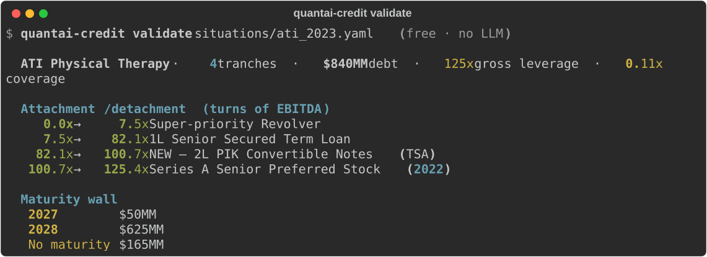

# QuantAI Credit — An Open-Source AI Distressed-Credit Committee

[](https://github.com/RahulModugula/quantai-dashboard/actions/workflows/ci.yml)
[](https://www.python.org/downloads/release/python-3110/)
[](LICENSE)
[](https://github.com/BerriAI/litellm)

> **Four AI agents debate a distressed-credit situation — leverage, recovery waterfall, fulcrum security, tail risks — and write the IC vote memo.**
> Point it at any deal in a YAML file. Every number comes from **deterministic, unit-tested Python**, not the model — so the math is auditable, not hallucinated. Model-agnostic (Claude / GPT / Grok / local Ollama). MIT licensed.

<p align="center">
  
</p>

The open-source "AI investing" projects that exist — [ai-hedge-fund](https://github.com/virattt/ai-hedge-fund) (~61k★), [TradingAgents](https://github.com/TauricResearch/TradingAgents) (~92k★), [FinRobot](https://github.com/AI4Finance-Foundation/FinRobot) (~7.5k★) — are all **equities/trading**. None does **distressed credit or restructuring**: recovery waterfalls, fulcrum-security identification, covenant analysis. This is the first to bring the multi-agent pattern to the **liability side of the balance sheet**.

The reason it isn't just another prompt wrapper: the LLM never does the arithmetic. Leverage, the pari-passu recovery waterfall, attachment/detachment in turns of EBITDA, the fulcrum security, asset coverage, the maturity wall — all deterministic, all unit-tested. The model brings judgment; the code keeps the numbers honest. You can see all of it **for free, with no API key**:

```bash
quantai-credit validate my_deal.yaml    # instant cap-structure snapshot, no LLM
```

<p align="center">
  
</p>

> **Analysis and education tool, not investment advice.** It makes no claim to beat any benchmark, and it doesn't replace a data terminal (Bloomberg, Octus/Reorg, 9fin) — it's a free, local, **auditable analysis layer** for the cap-structure work you'd otherwise build by hand.

---

## Quick demo (no API key, no install)

```bash
git clone https://github.com/RahulModugula/quantai-dashboard.git
cd quantai-dashboard
python -m examples.distressed.demo
```

Prints a full 4-agent credit committee memo on **ATI Physical Therapy's April 2023 Transaction Support Agreement** — an out-of-court loan-to-own restructuring — using only the Python standard library. It's the bundled worked example; the next section runs the committee on *your own* situation.

> The ATI case is analyzed at the **April 2023 entry point**, not in hindsight. The position later closed as a **$523.3M take-private in August 2025 (~11.2x LTM Adj EBITDA)** — shown as directional context for the thesis, not as a forecast the tool produced. See [docs/ARCHITECTURE.md](docs/ARCHITECTURE.md) for design notes.

---

## Run it on your own deal

The committee isn't hardcoded to ATI — point it at any distressed situation in a
YAML file and it writes the IC memo:

```bash
pip install -e .                      # lightweight: litellm + pyyaml + rich, no ML stack
quantai-credit new my_deal.yaml       # scaffold an annotated template
# ...fill in the cap structure, timeline, metrics, and risks...
quantai-credit validate my_deal.yaml  # free pre-flight: computed snapshot + sanity checks
quantai-credit run my_deal.yaml       # 4-agent committee → my_deal_memo.md + my_deal.json
quantai-credit list                   # show bundled example situations
```

A situation file is just the cap stack, a timeline, operating metrics, and the
risks you already see — no code. `validate` computes leverage, coverage,
attachment/detachment, and the maturity wall instantly and free; `run` adds the
4-agent debate and vote, writing both a human-readable memo (`_memo.md`) and a
machine-readable result (`.json`). Start from
[`TEMPLATE.yaml`](examples/distressed/situations/TEMPLATE.yaml) or copy a bundled example:

| Situation | Structure it teaches |
|-----------|---------------------|
| [`ati_2023.yaml`](examples/distressed/situations/ati_2023.yaml) | Loan-to-own via a 2L PIK convertible fulcrum (out-of-court TSA) |
| [`serta_2020.yaml`](examples/distressed/situations/serta_2020.yaml) | Non-pro-rata **uptier** / liability management — inside vs. outside the majority |
| [`hertz_2020.yaml`](examples/distressed/situations/hertz_2020.yaml) | **Asset-coverage** with a bankruptcy-remote fleet-ABS silo (Chapter 11) |

Each is sourced from public filings, with approximate figures marked inline.
Adding another is pure YAML — a great [first contribution](CONTRIBUTING.md).

> No LLM key? `python -m examples.distressed.demo` shows a complete sample memo
> with zero setup. To run live, set any LiteLLM-supported key
> (`ANTHROPIC_API_KEY`, `OPENAI_API_KEY`, `OPENROUTER_API_KEY`) or point
> `QUANTAI_AGENT_MODEL=ollama/llama3` at a local model for zero cost.

---

## What this is

**An AI distressed-credit committee** (`examples/distressed/`). Four agents debate a
restructuring and write an IC-style vote memo. They call deterministic Python tools
— the math doesn't vary by temperature — and hand structured briefs to each other:

- **CapStructureAgent** — leverage, coverage, fulcrum security, recovery waterfall (base/bear/bull)
- **SituationAgent** — docket/timeline events, catalysts, structural vs. noise, information gaps
- **CreditRiskAgent** — devil's advocate: stresses every assumption, enumerates tail and process risks
- **CreditCommitteeAgent** — the vote memo: instrument, sizing, target, catalyst, downside, conditions

You describe a situation in YAML — cap stack, timeline, operating metrics, known
risks — and run `quantai-credit run`. No code.

### The math is the point

Every quantitative claim traces to an audited function in
[`credit_tools.py`](examples/distressed/credit_tools.py), not to the model:

- **One canonical claim per tranche.** Face value is used consistently across the
  waterfall, breakeven, and attachment/detachment, so the tools never disagree
  about the same tranche. PIK accrual is opt-in and applied identically everywhere.
- **Preferred/equity is not debt.** Debt/EBITDA is computed over funded debt only;
  preferred sits in the recovery waterfall but never inflates leverage.
- **Fulcrum is correct at the boundary.** The fulcrum is the most-senior *impaired*
  claim — including when enterprise value lands exactly on a tranche boundary.
- **It refuses to fake the hard cases.** The generic waterfall is a pari-passu,
  going-concern (EV = EBITDA × multiple) model. When a situation is a non-pro-rata
  **uptier** (Serta) or an **asset-backed / bankruptcy-remote silo** (Hertz),
  `validate` says so loudly rather than printing a confident wrong number — and
  ships an `asset_coverage_ratio` / `collateral_recovery_pct` primitive for the
  silo case. Honesty about model limits is a feature.

This design directly answers the best-evidenced critique of LLMs on money — they
confidently get financial arithmetic wrong ([FinanceBench](https://arxiv.org/abs/2311.11944)
found GPT-4-Turbo wrong or refusing on ~81% of open-book financial questions). Here
the model never touches the arithmetic.

---

## Why the ATI case study matters

Not a textbook example — a real situation analyzed at the decision point:

| | |
|--|--|
| **Entry** | April 11, 2023 — Transaction Support Agreement; 2L PIK convertible, loan-to-own |
| **Cap structure (pro forma)** | $575M funded debt / 85.8x on $6.7M FY2022 EBITDA; $165M preferred excluded |
| **Thesis** | PT wage normalization → EBITDA recovery → fulcrum equity conversion |
| **System vote** | BUY — APPROVE WITH CONDITIONS, 1.0–1.5% AUM |
| **Outcome (context)** | Aug 1, 2025: $523.3M TEV take-private at ~11.2x LTM Adj EBITDA |

Capital structure, operating metrics, and timeline are sourced from public filings
(ATI 10-K FY2022, 10-Q Q1 2023, 8-K 04/21/2023). The August 2025 outcome is shown
as directional context, not as a prediction the tool made.

---

## Install

### Just the credit committee (default — lightweight)

The committee runs on **three dependencies** — `litellm`, `pyyaml`, `rich`. No ML
stack, no torch, no dashboard:

```bash
pip install -e .                 # adds the `quantai-credit` command on your PATH
quantai-credit list
quantai-credit validate examples/distressed/situations/ati_2023.yaml   # free, no key
```

CI proves this: a dedicated job installs the credit committee *without* the ML
stack and runs `validate` on every push.

### The equity reference build (optional, heavy)

The same `BaseAgent` loop also drives an equity-research pipeline — a second proof
that the architecture is asset-class-agnostic. It's a fuller "batteries-included"
trading playground and is **not required for the credit committee**. It lives
behind the `equity` extra and pulls the ML/data stack (torch, scikit-learn,
xgboost, Dash, FastAPI, ...):

```bash
pip install -e ".[equity]"       # or: docker compose up --build
make seed && make train && make run   # http://localhost:8000
```

What it includes: `QuantAgent → NewsAgent → RiskAgent → PortfolioManager` over a
walk-forward ML ensemble (RF + XGB + LightGBM + LSTM, no lookahead bias), SHAP
explainability, backtesting with Monte Carlo CIs, a FastAPI service, and a Plotly
Dash dashboard. See [docs/ARCHITECTURE.md](docs/ARCHITECTURE.md) for the full tour.

---

## Tests

```bash
make test-credit      # credit committee only (no ML stack)
make test             # everything, with coverage
```

The credit tools are covered by dedicated suites —
[`test_distressed_credit.py`](tests/test_distressed_credit.py),
[`test_credit_correctness.py`](tests/test_credit_correctness.py) (regression tests
pinning the fulcrum-boundary, tool-consistency, debt-vs-preferred, and
asset-coverage fixes), plus snapshot, situation-loader, and second-case (Envision)
suites. They verify the waterfall, fulcrum, leverage/coverage, attachment/detachment,
and the bundled situations against sourced numbers. The broader repo (~380 tests)
also covers the equity reference build.

---

## Project structure

```
examples/distressed/        # THE CREDIT COMMITTEE (the core)
├── models.py               # Situation, CapitalStructureTranche (debt vs preferred)
├── credit_tools.py         # leverage, coverage, waterfall, fulcrum, asset coverage
├── snapshot.py             # free `validate` snapshot + structural warnings
├── agents.py               # CapStructure, Situation, CreditRisk, CreditCommittee
├── run.py                  # the `quantai-credit` CLI
├── situations/             # ati_2023, serta_2020, hertz_2020, TEMPLATE (YAML)
└── demo.py                 # zero-dependency terminal demo

src/                        # EQUITY REFERENCE BUILD (optional `[equity]` extra)
├── agents/                 # shared BaseAgent + equity multi-agent layer
├── models/ data/ backtest/ trading/ advisor/ api/ dashboard/
```

---

## Limitations (read these)

- **Public data only.** Recovery and priority ultimately turn on credit agreements,
  indentures, and intercreditor terms that aren't always public. Treat this as
  **pre-diligence triage** and a structured-thinking framework — feed it your own
  documents when you have them; it structures the analysis, it doesn't source
  private data.
- **Multi-agent debate is not magic.** For genuine adversarial value, run the agents
  on *different* models via LiteLLM rather than four clones — homogeneous "debate"
  can manufacture false consensus.
- **LLMs can still hallucinate the narrative** even when the math is fixed. The
  deterministic tools constrain the numbers, not the prose.
- **Not investment advice**, no performance claim, no reliance. The equity reference
  build likely does not beat buy-and-hold after costs — expected, and consistent
  with the EMH for liquid US equities.

---

## License

MIT
