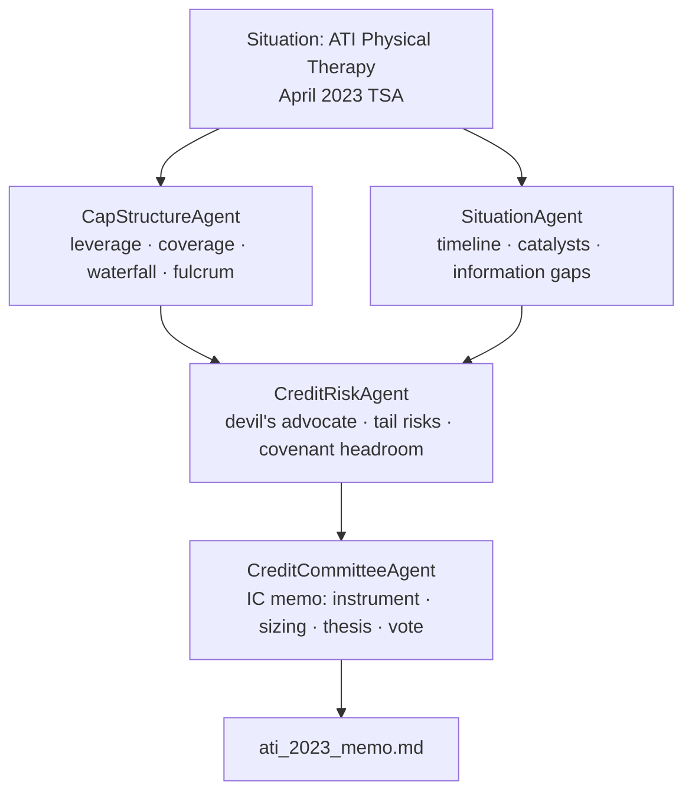

# QuantAI — Technical Portfolio
### AI Research Lead · Knighthead Capital Management

**Code:** [github.com/RahulModugula/quantai-dashboard](https://github.com/RahulModugula/quantai-dashboard) · **Demo:** `python -m examples.distressed.demo` (no API key)

---

## Five Things in 60 Seconds

**1. AI credit committee on a Knighthead trade.**
`examples/distressed/` runs a 4-agent debate on ATI Physical Therapy's April 2023 TSA — the loan-to-own entry Knighthead and Marathon used to build the equity position that closed as the August 2025 take-private ($523.3M TEV, ~11.2x EBITDA). The system recommended BUY on the 2L PIK Convertible. The outcome confirmed the base/bull thesis.

**2. Asset-class-agnostic architecture.**
The equity agents (`QuantAgent → NewsAgent → RiskAgent → PortfolioManager`) and the credit committee (`CapStructureAgent + SituationAgent → CreditRiskAgent → CreditCommitteeAgent`) share a single `BaseAgent` class. The pattern is substrate — not equities or credit. Pointing it at a new asset class means writing a subclass and a tool module, not modifying shared infrastructure.

**3. Quantitative tools, not just prompts.**
Credit agents call deterministic Python: `calculate_leverage()`, `calculate_coverage()`, `calculate_recovery_waterfall()`, `analyze_recovery_scenarios()`, `check_covenant_headroom()`. The LLM decides which tool to call and interprets the output. The math never varies by temperature.

**4. Walk-forward ML, no lookahead bias.**
Equity ensemble (RF 0.30 / XGB 0.30 / LGBM 0.25 / LSTM 0.15) retrains every 63 trading days using only data before prediction time. Features are joined strictly by date at the DataFrame merge — not enforced by convention. SHAP explainability on every signal.

**5. Production-grade and tested.**
Docker, Redis, Prometheus, async FastAPI, SQLite + Alembic, 328 tests across 23 modules, ruff + pre-commit, structured logging with correlation IDs. CI/CD green on every push.

---

## Architecture: Multi-Agent Credit Committee



All four agents subclass `BaseAgent` (`src/agents/base_agent.py`) — same retry logic, same 10-round tool-call loop, same `AgentBrief` output contract.

**Phase 1** (`asyncio.gather`): `CapStructureAgent` computes leverage, coverage, recovery waterfall, and identifies the fulcrum security. `SituationAgent` extracts key structural events, upcoming catalysts, and information gaps from the timeline. Both run in parallel.

**Phase 2**: `CreditRiskAgent` receives both Phase 1 briefs as context, plays devil's advocate — challenges recovery assumptions, surfaces tail risks, stress-tests covenant headroom with specific numbers.

**Phase 3**: `CreditCommitteeAgent` receives all three briefs and writes the IC vote memo: instrument, sizing range, target price, catalyst, conditions. The output is structured markdown with parseable `KEY: value` lines — `_parse_structured()` extracts them for downstream agents. Tool dispatch is async: `_dispatch_tool()` routes named functions to deterministic Python.

---

## ATI Physical Therapy Case Study (April 2023 TSA)

**Situation:** FY2022 EBITDA collapsed 83% ($39.8M → $6.7M) on PT wage inflation — a supply-side shock in a growing $53B outpatient market. HPS-led lenders signed a Transaction Support Agreement on April 11, 2023.

**Thesis:** Loan-to-own via 2L PIK convertible. Supply-side shocks resolve faster than demand-side. Enter at peak stress; PIK coupon eliminates near-term cash burn; fulcrum conversion gives majority equity control on the other side.

### Capital Structure at Decision Point

| Tranche | Face ($MM) | Rate | Maturity | Holder |
|---------|-----------|------|----------|--------|
| Super-priority Revolver | $50 | SOFR + ~500 | Feb 2027 | HPS Investment Partners |
| 1L Senior Secured Term Loan | $500 | SOFR + 725 | Feb 2028 | HPS Investment Partners |
| **NEW 2L PIK Convertible (TSA)** | **$125** | **8% PIK** | **Aug 2028** | **TSA participants** |
| Series A Senior Preferred | $165 | 8% cash / 10% PIK | Perpetual | Advent International |

*$25M new money + $100M exchanged from 1L.*

### Recovery Analysis

| Metric | Pre-TSA | Post-TSA |
|--------|---------|---------|
| LTM EBITDA | $6.7M | $6.7M (guided $25–35M FY2024) |
| Gross Debt | $550M | $840M incl. preferred |
| **Leverage** | **82.1x** | **85.8x** |
| Cash Interest | ~$61M | ~$49M (PIK eliminates 2L cash coupon) |
| **Coverage** | **0.11x** | **0.5–0.7x** |

**Recovery scenarios — 2L PIK Convertible:**

| Scenario | EBITDA | EV Multiple | Recovery |
|----------|--------|-------------|---------|
| Bear | $10–15M | 5.0x | 55–70c par |
| Base | $30M FY2024 | 7.0x | ~105c par |
| Bull | $50M+ FY2025 | **11.0x** | **250–320c par** |

> **August 1, 2025:** Knighthead Capital and Marathon Asset Management completed the take-private at $2.85/share, $523.3M TEV, ~11.2x LTM Adj EBITDA. The committee's base/bull thesis was confirmed. The system analyzed this at the April 2023 entry decision point — not with the benefit of hindsight.

**Committee vote:** APPROVE WITH CONDITIONS — 1.0–1.5% of AUM initial (~$12–18M on $1.2B fund), scale to 2.0% on Q3'23 EBITDA confirmation above $25M run-rate.

---

## Credit Analysis Tools

All tools return typed Python dataclasses that the LLM receives as JSON. Every calculation is deterministic and independently unit-tested (32 tests in `tests/test_distressed_credit.py` using ATI FY2022 numbers as ground truth).

```python
# Leverage ratio — optionally capitalizes lease obligations
calculate_leverage(
    total_debt_mm: float,
    ebitda_mm: float,
    include_lease_obligations: float = 0.0,
) -> float

# Interest coverage — optionally includes preferred dividends
calculate_coverage(
    ebitda_mm: float,
    cash_interest_mm: float,
    preferred_dividends_mm: float = 0.0,
) -> float

# Per-tranche recovery (%) at a given enterprise value
calculate_recovery_waterfall(
    capital_structure: list[CapitalStructureTranche],
    enterprise_value_mm: float,
    include_piK_accrual: bool = True,
) -> dict[str, float]

# Bear / base / bull recovery table across EBITDA and multiple assumptions
analyze_recovery_scenarios(
    capital_structure: list[CapitalStructureTranche],
    base_ebitda_mm: float,
    bear_ebitda_mm: float,
    bull_ebitda_mm: float,
    base_multiple: float = 7.0,
    bear_multiple: float = 5.0,
    bull_multiple: float = 11.0,
) -> list[RecoveryScenario]

# Covenant headroom — leverage and coverage breach detection
check_covenant_headroom(
    ebitda_mm: float,
    total_debt_mm: float,
    max_leverage_x: float = 5.0,
    min_coverage_x: float = 2.0,
    cash_interest_mm: float | None = None,
) -> list[CovenantStatus]

# Tranche where enterprise value is exhausted
calculate_fulcrum_security(
    capital_structure: list[CapitalStructureTranche],
    enterprise_value_mm: float,
) -> tuple[str | None, float | None]
```

---

## What I'd Build at Knighthead

The ATI case study is the demo. These are the tools I'd build for live deal workflow:

**Situation Monitor.** A daemon that watches SEC EDGAR filings (8-K, 10-Q, credit agreements) and trading levels for existing positions. When covenant headroom narrows below a threshold, an LTM EBITDA print misses, or a trading level crosses a key level, it runs the credit committee and pushes a delta brief — not a full re-analysis, just what changed and why it matters.

**Capital Structure Normalizer.** Ingests SEC credit agreement exhibits → normalizes into `CapitalStructureTranche` objects → instant waterfall analysis. Eliminates the manual data entry step before every IC meeting.

**Portfolio Stress Engine.** Given a set of current positions, runs simultaneous recovery scenarios across all of them. Flags correlated tail risk — e.g., "if the macro scenario that impairs Hertz also impairs Wheels Up, here's the portfolio-level loss."

**Docket Tracker.** Monitors bankruptcy court dockets for in-process Chapter 11 positions. Agents summarize key filings (plan of reorganization, claims objections, DIP hearings) and flag items that materially change the recovery thesis.

**Cross-Asset Signal Bridge.** When the equity or CDS on a credit position moves materially, auto-triggers a refreshed credit risk assessment with updated market-implied recovery assumptions — so the credit team has context before the PM asks for it.

All of these are extensions of the architecture that already exists. The agent loop, the tool dispatch pattern, and the structured output format are already built. The work is domain tools and data plumbing, not foundational infrastructure.

---

## Equity ML Pipeline

### Ensemble

| Model | Weight | What It Captures |
|-------|--------|-----------------|
| Random Forest | 0.30 | Non-linear interactions via bootstrap aggregation |
| XGBoost | 0.30 | Sequential error correction on tabular patterns |
| LightGBM | 0.25 | Leaf-wise growth; fast quarterly retraining |
| LSTM | 0.15 | Temporal sequence modeling: momentum and mean reversion |

Combined: `p = 0.30·p_rf + 0.30·p_xgb + 0.25·p_lgbm + 0.15·p_lstm`

Classification target: next-day price direction. Calibrated probabilities → Half-Kelly sizing: `f* = (p·b − q) / b`.

### Walk-Forward Validation

```
┌────────────────────────────────────────────────────────────┐
│  Fold 1: Train [0, 252)   → Predict [252, 315)             │
│  Fold 2: Train [0, 315)   → Predict [315, 378)             │
│  Fold 3: Train [0, 378)   → Predict [378, 441)             │
│  ...expanding window, retrain every 63 trading days...     │
└────────────────────────────────────────────────────────────┘
```

Features at prediction time `t` use only data timestamped before `t`, enforced at the DataFrame merge step, not by convention. Expanding windows keep tree models stable — earlier signal doesn't decay.

### Feature Engineering (39 Features)

**Momentum / Trend (8):** `rsi_14`, `macd`, `macd_signal`, `macd_hist`, `adx_14`, `stoch_k`, `stoch_d`, `momentum_5/20`

**Volatility / Bands (5):** `atr_14`, `bb_upper`, `bb_lower`, `bb_pct_b`, `bb_bandwidth`

**Mean Reversion (5):** `close_to_sma50`, `close_to_sma200`, `sma50_to_sma200`, `mean_reversion_5`, `mean_reversion_20`

**Rolling Statistics (4):** `volatility_5`, `volatility_20`, `momentum_5`, `momentum_20`

**Lagged Returns (4):** `return_lag_1`, `return_lag_2`, `return_lag_3`, `return_lag_5`

**Volume (3):** `volume_ratio`, `obv`, `obv_zscore`

**Macro (2, optional):** `vix_close`, `vix_regime`

### SHAP Explainability

Per-model SHAP values on every prediction. Ensemble importance = weighted average across models (matching prediction weights). Top-10 features surfaced in `QuantAgent` brief and a dedicated dashboard tab. Time-varying importance tracked across walk-forward folds — detects when signal sources rotate across regimes.

---

## BaseAgent: The Shared Foundation

`src/agents/base_agent.py` — 214 lines. Both the equity pipeline and the credit committee inherit from it without modification.

```python
@dataclass
class AgentBrief:
    agent_name: str
    ticker: str
    content: str              # Markdown-formatted analysis
    structured_data: dict     # Parsed KEY: value fields
    tool_calls_made: list[str]
    tokens_used: int
    error: str | None = None
```

**Agentic loop:**
```
For up to 10 tool-call rounds:
  1. litellm.acompletion(model, messages, tools)
  2. If no tool_calls → return AgentBrief(content)
  3. Append assistant message with tool calls
  4. For each tool call: _dispatch_tool(name, args) → append result
  5. Loop
If 10 rounds exceeded → AgentBrief(error="tool_call_limit_exceeded")
On timeout or exception → retry up to max_retries with 1s backoff
```

`_dispatch_tool()` is abstract — credit agents route to the deterministic Python tools above; equity agents route to yfinance, SEC EDGAR, and ML prediction calls.

`_parse_structured()` scans non-indented lines for `RECOMMENDATION`, `INSTRUMENT`, `SIZING`, `TARGET PRICE`, `CATALYST`, `VERDICT`, `RISK RATING`, `SIGNAL`, `CONFIDENCE` — parsed values pass between agents as typed hand-offs.

**LiteLLM backend:** same code runs Claude, GPT-4, or Ollama. Swap `QUANTAI_AGENT_MODEL` env var. For demo/development: `ollama/llama3` runs locally at zero cost. For production: `anthropic/claude-opus-4-7` or `openrouter/x-ai/grok-4.20`.

---

## Engineering Stack

| Layer | Technology | Notes |
|-------|------------|-------|
| ML | scikit-learn, XGBoost, LightGBM, PyTorch (LSTM), Optuna | Walk-forward + SHAP |
| AI Agents | LiteLLM, asyncio, tool-call loop | Model-agnostic; swap via env var |
| Credit Tools | Pure Python dataclasses | Deterministic, 32 unit tests |
| Portfolio | PyPortfolioOpt | Efficient frontier, HRP, min-vol |
| API | FastAPI, uvicorn, WebSocket | Async-first |
| Dashboard | Plotly Dash, WSGIMiddleware | 8 tabs |
| Data | yfinance, SQLite, SQLAlchemy, Alembic | Free data only |
| Cache | Redis | Optional, graceful degradation |
| Observability | structlog, Prometheus, correlation IDs | Production-grade |
| Testing | pytest, 328 tests, asyncio_mode=auto | 23 modules |
| CI/CD | GitHub Actions, ruff, pre-commit | Green on every push |
| Infra | Docker Compose (dev + prod multi-stage) | Nginx reverse proxy |

---

## Running It

```bash
# Instant demo — no API key, no dependencies beyond stdlib
python -m examples.distressed.demo
```

```bash
# Live credit committee — generates fresh IC memo
export ANTHROPIC_API_KEY=sk-ant-...   # or OPENAI_API_KEY, or OPENROUTER_API_KEY
python -m examples.distressed.ati_2023    # writes ati_2023_live_memo.md
```

```bash
# Full equity trading system
docker compose up --build
# Dashboard: http://localhost:8000/dashboard
# API docs:  http://localhost:8000/api/docs
```

---

## Design Decisions

**Why the same BaseAgent works for equities and credit.** The loop cares only about `context: dict`, a list of tool schemas, and abstract `_dispatch_tool()`. Neither the retry logic, token accounting, nor structured-output parsing knows which asset class is running. Adding a new asset class means writing a subclass and a tool module — not modifying shared infrastructure.

**Why expanding windows over rolling windows.** A feature that mattered two years ago genuinely informed the model that generated today's signal. Rolling windows discard that history and overstate how poorly the model would have performed with less data. The hard constraint is the date-join at the DataFrame merge step — earlier history is included in training, but future data never touches predictions.

**Why classification over regression.** Calibrated probabilities map directly to Half-Kelly sizing: `f* = (p·b − q) / b`. A SHAP value of "RSI_14 pushed BUY probability up 4.2 percentage points" is actionable; "RSI_14 added 0.003 to predicted return" is not.

**Why LiteLLM.** The tool-call protocol (OpenAI function-calling schema) is an industry standard. LiteLLM normalizes all provider variants into one interface. Swapping from Claude to Grok to local Ollama is one environment variable — no code changes.

**Why deterministic Python tools alongside LLMs.** Leverage is `total_debt / ebitda`. That should not vary by temperature, prompt phrasing, or model version. Wrapping it in a typed function with a unit test makes the recovery waterfall auditable — wrong in the same way every time if inputs are wrong. The LLM brings judgment; the tools bring correctness.

---

_Source: [github.com/RahulModugula/quantai-dashboard](https://github.com/RahulModugula/quantai-dashboard) — April 2026_
