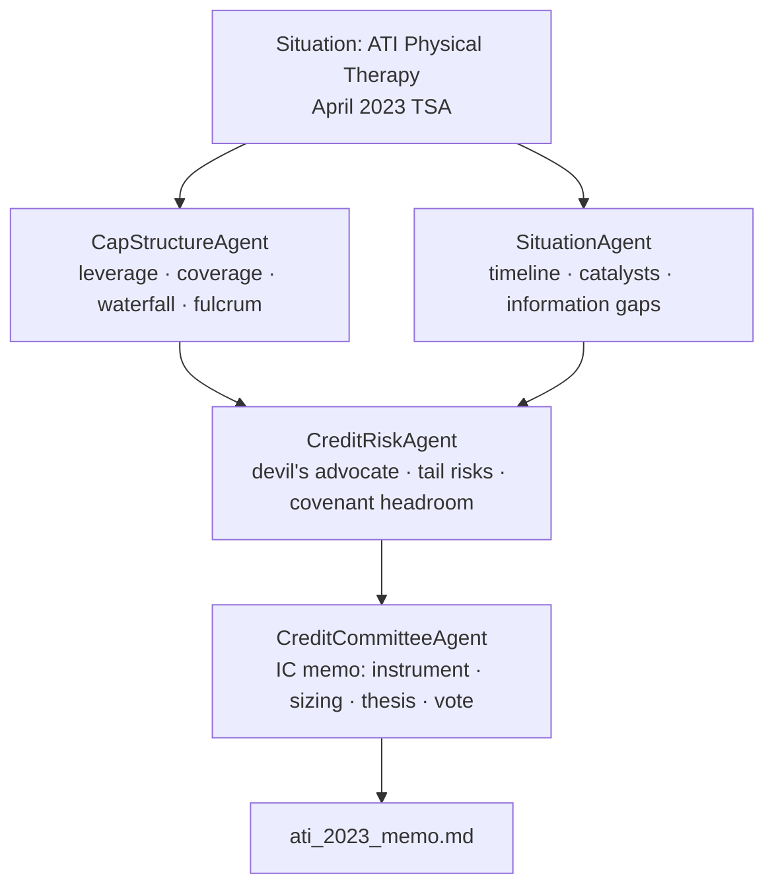

# QuantAI — Technical Portfolio

## For Knighthead Capital Evaluators

---

### Five Things to Know in 60 Seconds

1. **AI credit committee on your actual trade.** The `examples/distressed/` module runs a 4-agent debate on ATI Physical Therapy's April 2023 TSA — the loan-to-own entry Knighthead and Marathon used to build the equity position that closed as the August 2025 take-private ($523.3M TEV, ~11.2x EBITDA). The system recommended BUY on the 2L PIK Convertible. The outcome confirmed the base/bull thesis.

2. **Asset-class-agnostic agentic architecture.** The equity agents (`QuantAgent → NewsAgent → RiskAgent → PortfolioManager`) and the credit committee (`CapStructureAgent + SituationAgent → CreditRiskAgent → CreditCommitteeAgent`) share a single `BaseAgent` class with an LLM tool-call loop. The pattern is substrate — not equities or credit.

3. **Quantitative tools, not just prompts.** Credit agents call domain-specific functions: `calculate_leverage()`, `calculate_coverage()`, `calculate_recovery_waterfall()`, `analyze_recovery_scenarios()`, `check_covenant_headroom()`. The LLM orchestrates the math; the math is deterministic Python.

4. **Walk-forward ML with no lookahead bias.** The equity ensemble (RF 0.30 / XGB 0.30 / LGBM 0.25 / LSTM 0.15) is retrained every 63 trading days using only data before prediction time. SHAP explainability on every signal.

5. **Production-grade.** Docker, Redis, Prometheus, async FastAPI, SQLite with Alembic migrations, 296 tests, ruff + pre-commit, structured logging with correlation IDs.

---

## Architecture: Multi-Agent Credit Committee



All four agents subclass `BaseAgent` (`src/agents/base_agent.py`) — same retry logic, same 10-round tool-call loop, same `AgentBrief` output contract.

**Phase 1** runs in parallel via `asyncio.gather`: `CapStructureAgent` computes leverage, coverage, recovery waterfall, and identifies the fulcrum security; `SituationAgent` extracts key structural events, upcoming catalysts, and information gaps from the timeline.

**Phase 2**: `CreditRiskAgent` receives both Phase 1 briefs as context and plays devil's advocate — challenging recovery assumptions, surfacing tail risks, and stress-testing covenant headroom.

**Phase 3**: `CreditCommitteeAgent` receives all three briefs and writes the IC vote memo with a specific instrument, sizing range, target price, and explicit conditions.

Each agent's output is structured markdown with parseable `KEY: value` lines — `_parse_structured()` in `BaseAgent` extracts them for downstream agents. Tool dispatch is async: `_dispatch_tool()` routes named functions to deterministic Python.

---

## ATI Physical Therapy Case Study (April 2023 TSA)

**Thesis:** Loan-to-own via 2L PIK convertible in a margin-compressed but recoverable outpatient PT platform, entering at a structurally distressed moment with asymmetric equity upside on PT wage normalization.

### Capital Structure at Decision Point

| Tranche | Face ($MM) | Rate | Maturity | Holder |
|---------|-----------|------|----------|--------|
| Super-priority Revolver | $50 | SOFR + ~500 | Feb 2027 | HPS Investment Partners |
| 1L Senior Secured Term Loan | $500 | SOFR + 725 | Feb 2028 | HPS Investment Partners |
| **NEW 2L PIK Convertible (TSA)** | **$125** | **8% PIK** | **Aug 2028** | **TSA participants** |
| Series A Senior Preferred | $165 | 8% cash / 10% PIK | Perpetual | Advent International |

*Structure: $25M new money + $100M exchanged from 1L into 2L PIK Convertible.*

### Recovery Analysis

| Metric | Pre-TSA | Post-TSA |
|--------|---------|---------|
| LTM EBITDA | $6.7M | $6.7M (guided $25–35M FY2024) |
| Gross Debt | $550M | $840M incl. preferred |
| **Leverage** | **82.1x** | **85.8x** |
| Cash Interest | ~$61M | ~$49M (PIK eliminates 2L cash coupon) |
| **Coverage** | **0.11x** | **0.5–0.7x** |

**Recovery scenarios (2L PIK Convertible):**

| Scenario | Assumed EBITDA | EV Multiple | Recovery |
|----------|---------------|-------------|---------|
| Bear | $10–15M | 5.0x | 55–70c par |
| Base | $30M FY2024 | 7.0x | ~105c par |
| Bull | $50M+ FY2025 | 11.0x | 250–320c par |

> **August 1, 2025:** Knighthead Capital and Marathon Asset Management completed the take-private at $2.85/share, $523.3M TEV, ~11.2x LTM Adj EBITDA. The committee's base/bull thesis was confirmed. The system analyzed this trade at the April 2023 entry decision point — not with the benefit of hindsight.

**Committee vote:** APPROVE WITH CONDITIONS
- Initial: 1.0–1.5% of AUM (~$12–18M on $1.2B fund)
- Scale to 2.0% on Q3'23 EBITDA print confirming $25M+ run-rate
- Conditions: final indenture terms match TSA summary; independent asset coverage valuation

---

## Credit Analysis Tools

All tools return structured Python dataclasses that the LLM receives as JSON and reasons over. Every calculation is deterministic and independently testable.

```python
# Leverage multiple — optionally capitalizes lease obligations
calculate_leverage(
    total_debt_mm: float,
    ebitda_mm: float,
    include_lease_obligations: float = 0.0,
) -> float

# Interest coverage — optionally includes preferred dividends
calculate_coverage(
    ebitda_mm: float,
    cash_interest_mm: float,
    preferred_dividends_mm: float = 0.0,
) -> float

# Per-tranche recovery (%) given a specific enterprise value
calculate_recovery_waterfall(
    capital_structure: list[CapitalStructureTranche],
    enterprise_value_mm: float,
    include_piK_accrual: bool = True,
) -> dict[str, float]

# Bear / base / bull recovery table across three EBITDA and multiple assumptions
analyze_recovery_scenarios(
    capital_structure: list[CapitalStructureTranche],
    base_ebitda_mm: float,
    bear_ebitda_mm: float,
    bull_ebitda_mm: float,
    base_multiple: float = 7.0,
    bear_multiple: float = 5.0,
    bull_multiple: float = 11.0,
) -> list[RecoveryScenario]

# Headroom against max leverage and min coverage covenants
check_covenant_headroom(
    ebitda_mm: float,
    total_debt_mm: float,
    max_leverage_x: float = 5.0,
    min_coverage_x: float = 2.0,
    cash_interest_mm: float | None = None,
) -> list[CovenantStatus]

# Identifies the tranche where enterprise value is exhausted
calculate_fulcrum_security(
    capital_structure: list[CapitalStructureTranche],
    enterprise_value_mm: float,
) -> tuple[str | None, float | None]
```

`RecoveryScenario` and `CovenantStatus` are dataclasses — `scenario_name`, `ebitda_mm`, `enterprise_value_mm`, `recovery_by_tranche`, `fulcrum_tranche`; and `covenant_name`, `current_value`, `threshold`, `headroom_pct`, `is_breached`, `description` respectively.

---

## Equity ML Pipeline

### Ensemble Architecture

| Model | Weight | What It Captures |
|-------|--------|-----------------|
| Random Forest | 0.30 | Non-linear interactions via bootstrap aggregation |
| XGBoost | 0.30 | Sequential error correction, gradient-boosted trees |
| LightGBM | 0.25 | Leaf-wise growth; strong on financial time series |
| LSTM | 0.15 | Temporal sequence modeling: momentum and mean reversion |

Combined probability: `p = 0.30·p_rf + 0.30·p_xgb + 0.25·p_lgbm + 0.15·p_lstm`

Classification target: next-day price direction. Calibrated probabilities feed Half-Kelly position sizing.

### Walk-Forward Validation

Predictions at time `t` use only data before `t`. No lookahead bias. Features are joined strictly by date — no data from `t` onwards ever touches predictions at `t`. Retrain every 63 trading days (one quarter).

```
┌────────────────────────────────────────────────────────────┐
│  Fold 1: Train [0, 252)   → Predict [252, 315)             │
│  Fold 2: Train [0, 315)   → Predict [315, 378)             │
│  Fold 3: Train [0, 378)   → Predict [378, 441)             │
│  ...expanding window...                                     │
└────────────────────────────────────────────────────────────┘
```

Expanding windows (not rolling) keep tree models stable — earlier signal doesn't decay, and the hard date-join constraint enforces the no-lookahead guarantee regardless of window type.

### Feature Engineering (39 Features)

**Momentum / Trend (8):** `rsi_14`, `macd`, `macd_signal`, `macd_hist`, `adx_14`, `stoch_k`, `stoch_d`, `momentum_5/20`

**Volatility / Bands (5):** `atr_14`, `bb_upper`, `bb_lower`, `bb_pct_b`, `bb_bandwidth`

**Mean Reversion (5):** `close_to_sma50`, `close_to_sma200`, `sma50_to_sma200`, `mean_reversion_5`, `mean_reversion_20`

**Rolling Statistics (4):** `volatility_5`, `volatility_20`, `momentum_5`, `momentum_20`

**Lagged Returns (4):** `return_lag_1`, `return_lag_2`, `return_lag_3`, `return_lag_5`

**Volume (3):** `volume_ratio`, `obv`, `obv_zscore`

**Macro (2, optional):** `vix_close`, `vix_regime`

### SHAP Explainability

- Per-model SHAP values computed for every prediction
- Ensemble-level importance = weighted average across models (matching the probability weights)
- Top-10 features surfaced in the `QuantAgent` brief and a dedicated dashboard tab
- Time-varying importance tracked across walk-forward folds — detects regime shifts where signal sources rotate

---

## BaseAgent: The Shared Foundation

`src/agents/base_agent.py` is 214 lines. Both the equity pipeline and the credit committee inherit from it without modification.

### AgentBrief Dataclass

```python
@dataclass
class AgentBrief:
    agent_name: str
    ticker: str
    content: str              # Markdown-formatted analysis
    structured_data: dict     # Parsed KEY: value fields
    tool_calls_made: list[str]
    tokens_used: int
    error: str | None = None
```

### Agentic Loop

```
For up to 10 tool-call rounds:
  1. litellm.acompletion(model, messages, tools)
  2. If no tool_calls in response → return AgentBrief(content)
  3. Append assistant message with tool calls
  4. For each tool call: _dispatch_tool(name, args) → append result
  5. Loop
If 10 rounds exceeded → return AgentBrief(error="tool_call_limit_exceeded")
On timeout or exception → retry up to max_retries with 1s backoff
```

`_dispatch_tool()` is abstract — each subclass routes to its own tool implementations. Credit agents route to the deterministic Python functions above; equity agents route to yfinance, SEC EDGAR, and ML prediction calls.

### Structured Output Parsing

`_parse_structured()` scans non-indented lines for:

```
SIGNAL · DECISION · CONFIDENCE · RISK RATING · VERDICT · SENTIMENT
RECOMMENDATION · INSTRUMENT · SIZING · RECOVERY · TARGET PRICE · CATALYST
```

Parsed values flow into `AgentBrief.structured_data` and are passed as context to downstream agents in the pipeline, enabling typed hand-offs between phases without string parsing.

### LiteLLM Backend

Same code runs Claude, GPT-4, or Ollama — swap `QUANTAI_AGENT_MODEL` env var. Demos run against a pre-rendered memo (no API key needed); production runs against Claude claude-opus-4-7 or claude-sonnet-4-6. The model-agnostic design means the credit committee can run locally at zero marginal cost during development.

---

## Engineering Stack

| Layer | Technology | Notes |
|-------|------------|-------|
| ML | scikit-learn, XGBoost, LightGBM, PyTorch (LSTM), Optuna | Walk-forward + SHAP |
| AI Agents | LiteLLM, asyncio, tool-call loop | Model-agnostic; swap via env var |
| Credit Tools | Pure Python dataclasses | Deterministic, independently testable |
| Portfolio | PyPortfolioOpt | Efficient frontier, HRP, min-vol |
| API | FastAPI, uvicorn, WebSocket | Async-first |
| Dashboard | Plotly Dash, mounted via WSGIMiddleware | 8 tabs |
| Data | yfinance, SQLite, SQLAlchemy, Alembic | Free data only |
| Cache | Redis | Optional, graceful degradation |
| Observability | structlog, Prometheus, correlation IDs | Production-grade |
| Testing | pytest, 296 tests, asyncio_mode=auto | 23 modules |
| CI/CD | GitHub Actions, ruff, pre-commit | Clean on every push |
| Infra | Docker Compose (dev + prod multi-stage) | Nginx reverse proxy in prod |

---

## Running It

```bash
# Instant demo — no API key, no dependencies beyond stdlib
python -m examples.distressed.demo
```

```bash
# Live credit committee (requires LLM API key)
export ANTHROPIC_API_KEY=sk-ant-...
python -m examples.distressed.ati_2023    # writes ati_2023_live_memo.md
```

```bash
# Full equity trading system
docker compose up --build
# Dashboard: http://localhost:8000/dashboard
# API docs:  http://localhost:8000/api/docs
```

---

## Design Decisions Worth Discussing

**Why the same BaseAgent works for equities and credit.** The agentic loop cares only about a `context: dict`, a list of tool schemas, and an abstract `_dispatch_tool()`. The equity pipeline passes `ticker`, `ml_signal`, and prior agent briefs; the credit pipeline passes a `Situation` object with capital structure and timeline. Neither the retry logic, the token accounting, nor the structured-output parsing needs to know which asset class it's running. That's the value of the context-dict + abstract-dispatch pattern — you add a new asset class by writing a subclass and a tool module, not by modifying shared infrastructure.

**Why expanding windows over rolling windows for walk-forward.** Rolling windows introduce a subtle survivorship artifact for tree models: a feature that mattered two years ago genuinely informed the model that later generated the signal. Discarding it overstates how poorly the model would have done with less data. Expanding windows match how a live system actually retrains — it accumulates history. The hard requirement is the date-join constraint: features at prediction time `t` are assembled using only data timestamped before `t`, enforced at the DataFrame merge step, not as a convention.

**Why classification over regression for equity signals.** Predicting direction gives calibrated probabilities, which map directly to Half-Kelly position sizing: `f* = (p·b - q) / b` where `b` is the expected gain-to-loss ratio. A regression target (predicted return) has heavier distributional tails and requires a separate calibration step to get sizing fractions. Classification also makes SHAP values interpretable to a PM: "RSI_14 pushed the BUY probability up 4.2 percentage points" is actionable; "RSI_14 added 0.003 to the predicted return" is not.

**Why LiteLLM as the backbone.** The business reason is cost containment during development: point `QUANTAI_AGENT_MODEL` at `ollama/llama3` and the credit committee runs locally at zero marginal cost. The engineering reason is that the tool-call protocol (OpenAI function-calling schema) is now an industry standard — LiteLLM normalizes the dozen provider variants into one interface. If Anthropic ships a faster claude-haiku-4-5 or a cheaper provider undercuts on price, swapping is one environment variable.

**Why deterministic Python tools alongside LLMs.** The LLM is the orchestrator — it decides which tool to call, in what order, and how to interpret the results in context. But leverage is `total_debt / ebitda`: that arithmetic should not vary by temperature, prompt phrasing, or model version. Wrapping it in a typed Python function with a unit test means the recovery waterfall is auditable, reproducible, and wrong in the same way every time if the inputs are wrong. The LLM brings judgment; the tools bring correctness.

---

_Source: github.com/RahulModugula/quantai-dashboard — April 2026_
