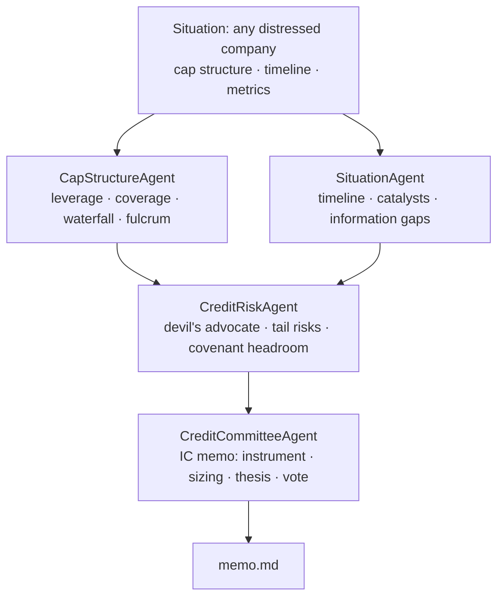

# Architecture & Design

How the AI credit committee works, why it's built this way, and where it extends.

**Code:** [github.com/RahulModugula/quantai-dashboard](https://github.com/RahulModugula/quantai-dashboard) · **Zero-setup demo:** `python -m examples.distressed.demo` · **Run your own deal:** `quantai-credit run my_deal.yaml`

---

## In 60 Seconds

**1. An AI credit committee you can point at any deal.**
Describe a distressed situation in a YAML file — cap structure, timeline, operating metrics, risks — and four agents debate it and write an IC-style vote memo. The bundled worked example is ATI Physical Therapy's April 2023 Transaction Support Agreement (the loan-to-own entry that closed as the August 2025 take-private at $523.3M TEV, ~11.2x LTM Adj EBITDA). The committee, analyzing at the April 2023 *entry* point, recommended BUY on the 2L PIK Convertible; the outcome confirmed the base/bull thesis.

**2. Asset-class-agnostic architecture.**
The credit committee (`CapStructureAgent + SituationAgent → CreditRiskAgent → CreditCommitteeAgent`) and an equity-research pipeline (`QuantAgent → NewsAgent → RiskAgent → PortfolioManager`) share a single `BaseAgent` class. The pattern is substrate — not credit or equities. Pointing it at a new asset class means writing a subclass and a tool module, not modifying shared infrastructure.

**3. Quantitative tools, not just prompts.**
Credit agents call deterministic Python: `calculate_leverage()`, `calculate_coverage()`, `calculate_recovery_waterfall()`, `analyze_recovery_scenarios()`, `check_covenant_headroom()`, `calculate_fulcrum_security()`. The LLM decides which tool to call and interprets the output. The math never varies by temperature.

**4. Walk-forward ML on the equity side, no lookahead bias.**
The equity ensemble (RF 0.30 / XGB 0.30 / LGBM 0.25 / LSTM 0.15) retrains every 63 trading days using only data before prediction time. Features are joined strictly by date at the DataFrame merge — not enforced by convention. SHAP explainability on every signal.

**5. Production-grade and tested.**
Docker, Redis, Prometheus, async FastAPI, SQLite + Alembic, ruff + pre-commit, structured logging with correlation IDs, and a full test suite covering both the credit tools and the ML pipeline. CI green on every push.

---

## Architecture: Multi-Agent Credit Committee



All four agents subclass `BaseAgent` (`src/agents/base_agent.py`) — same retry logic, same 10-round tool-call loop, same `AgentBrief` output contract.

**Phase 1** (`asyncio.gather`): `CapStructureAgent` computes leverage, coverage, the recovery waterfall, and identifies the fulcrum security. `SituationAgent` extracts key structural events, upcoming catalysts, and information gaps from the timeline. Both run in parallel.

**Phase 2**: `CreditRiskAgent` receives both Phase 1 briefs as context, plays devil's advocate — challenges recovery assumptions, surfaces tail risks, stress-tests covenant headroom with specific numbers.

**Phase 3**: `CreditCommitteeAgent` receives all three briefs and writes the IC vote memo: instrument, sizing range, target price, catalyst, conditions. The output is structured markdown with parseable `KEY: value` lines — `_parse_structured()` extracts them for downstream agents. Tool dispatch is async: `_dispatch_tool()` routes named functions to deterministic Python.

The input is a `Situation` (`examples/distressed/models.py`) loaded from a YAML/JSON file via `Situation.from_file()`. Nothing is hardcoded to any one company — see [`examples/distressed/situations/`](../examples/distressed/situations/) for the bundled examples and the annotated template.

---

## Worked Example: ATI Physical Therapy (April 2023 TSA)

**Situation:** FY2022 EBITDA collapsed 83% ($39.8M → $6.7M) on PT wage inflation — a supply-side shock in a growing $53B outpatient market. HPS-led lenders signed a Transaction Support Agreement on April 11, 2023.

**Thesis:** Loan-to-own via 2L PIK convertible. Supply-side shocks resolve faster than demand-side. Enter at peak stress; the PIK coupon eliminates near-term cash burn; fulcrum conversion gives majority equity control on the other side.

### Capital Structure (pro forma for the TSA)

| Tranche | Face ($MM) | Rate | Maturity | Holder |
|---------|-----------|------|----------|--------|
| Super-priority Revolver | $50 | SOFR + ~500 | Feb 2027 | HPS Investment Partners |
| 1L Senior Secured Term Loan (post-exchange) | $400 | SOFR + 725 | Feb 2028 | HPS Investment Partners |
| **NEW 2L PIK Convertible (TSA)** | **$125** | **8% PIK** | **Aug 2028** | **TSA participants** |
| Series A Senior Preferred *(equity-like, excluded from debt)* | $165 | 8% cash / 10% PIK | Perpetual | Advent International |

*The TSA exchanges $100M of the 1L into the new 2L PIK (1L: $500M → $400M) and
adds $25M new money — no double-count.*

### Recovery Analysis

| Metric | Pre-TSA | Pro forma (post-exchange) |
|--------|---------|---------|
| LTM EBITDA | $6.7M | $6.7M (guided $25–35M FY2024) |
| Funded debt | $550M | $575M ($550M + $25M new money) |
| **Leverage** | **82.1x** | **85.8x** |
| Preferred (excluded from debt) | $165M | $165M |
| Cash Interest | ~$61M | ~$49M (PIK eliminates 2L cash coupon) |
| **Coverage** | **0.11x** | **0.5–0.7x** |

**Recovery scenarios — 2L PIK Convertible:**

| Scenario | EBITDA | EV Multiple | Recovery |
|----------|--------|-------------|---------|
| Bear | $10–15M | 5.0x | 55–70c par |
| Base | $30M FY2024 | 7.0x | ~105c par |
| Bull | $50M+ FY2025 | **11.0x** | **250–320c par** |

> **August 1, 2025:** Knighthead Capital and Marathon Asset Management completed the take-private at $2.85/share, $523.3M TEV, ~11.2x LTM Adj EBITDA. The committee's base/bull thesis was confirmed. The system analyzed this at the April 2023 entry decision point — not with the benefit of hindsight.

**Committee vote:** APPROVE WITH CONDITIONS — 1.0–1.5% of AUM initial, scale to 2.0% on Q3'23 EBITDA confirmation above $25M run-rate.

All figures are sourced from public filings (ATI 10-K FY2022, 10-Q Q1 2023, 8-K 04/21/2023, 8-K 06/15/2023, DEF 14A 05/01/2023). The full situation lives in [`examples/distressed/situations/ati_2023.yaml`](../examples/distressed/situations/ati_2023.yaml).

---

## Credit Analysis Tools

All tools return typed Python dataclasses that the LLM receives as JSON. Every calculation is deterministic and independently unit-tested against the ATI FY2022 numbers as ground truth (`tests/test_distressed_credit.py`).

```python
# Leverage ratio — optionally capitalizes lease obligations
calculate_leverage(total_debt_mm, ebitda_mm, include_lease_obligations=0.0) -> float

# Interest coverage — optionally includes preferred dividends
calculate_coverage(ebitda_mm, cash_interest_mm, preferred_dividends_mm=0.0) -> float

# Per-tranche recovery (%) at a given enterprise value. Face value is the
# canonical claim; PIK accrual is opt-in (off by default) and, when on, applied
# consistently across the waterfall, breakeven, and attach/detach.
calculate_recovery_waterfall(capital_structure, enterprise_value_mm, include_pik_accrual=False) -> dict

# Asset-coverage / silo recovery (for bankruptcy-remote or ABS structures the
# going-concern waterfall can't model): recovery from a dedicated collateral pool.
collateral_recovery_pct(collateral_value_mm, secured_claim_mm) -> float
asset_coverage_ratio(collateral_value_mm, secured_claim_mm) -> float

# Bear / base / bull recovery table across EBITDA and multiple assumptions
analyze_recovery_scenarios(capital_structure, base_ebitda_mm, bear_ebitda_mm, bull_ebitda_mm,
                           base_multiple=7.0, bear_multiple=5.0, bull_multiple=11.0) -> list

# Covenant headroom — leverage and coverage breach detection
check_covenant_headroom(ebitda_mm, total_debt_mm, max_leverage_x=5.0, min_coverage_x=2.0,
                        cash_interest_mm=None) -> list

# Tranche where enterprise value is exhausted
calculate_fulcrum_security(capital_structure, enterprise_value_mm) -> tuple

# Attachment / detachment per tranche, in turns of EBITDA (where you sit)
calculate_attachment_detachment(capital_structure, ebitda_mm) -> list

# Enterprise value at which a tranche starts to recover, and is made whole
calculate_breakeven_ev(capital_structure, tranche_name) -> tuple

# Yield on a traded tranche
current_yield(coupon_pct, price_pct_par) -> float
approx_ytm(coupon_pct, price_pct_par, years_to_maturity) -> float

# Face amount by maturity year (the maturity wall)
summarize_maturity_wall(capital_structure) -> dict
```

The recovery waterfall pays strictly by seniority, treats tranches that share a
rank as **pari passu** (pro-rata by claim), and pays super-priority/admin claims
off the top. Claims are measured at face value by default; PIK accretion is an
explicit, consistently-applied scenario. It is a going-concern pari-passu model —
for non-pro-rata uptiers or asset-backed silos it warns rather than guessing. The
same functions power the free `quantai-credit validate` snapshot — leverage,
coverage, attach/detach, and the maturity wall computed with no LLM.

---

## Roadmap & Extension Points

The committee is the substrate. These are natural extensions, most of which are domain tools and data plumbing on top of the existing agent loop rather than new infrastructure — good contribution targets:

**More situation libraries.** The biggest near-term win is breadth: more real situations in `examples/distressed/situations/`, each a self-contained YAML. Adding one is pure data entry — an ideal first contribution.

**Situation Monitor.** A daemon that watches SEC EDGAR filings (8-K, 10-Q, credit agreements) and trading levels for tracked positions. When covenant headroom narrows below a threshold, an LTM EBITDA print misses, or a trading level crosses a key level, it re-runs the committee and pushes a delta brief — what changed and why it matters — not a full re-analysis.

**Capital Structure Normalizer.** Ingests SEC credit-agreement exhibits → normalizes into `CapitalStructureTranche` objects → instant waterfall analysis. Eliminates manual data entry before a committee run.

**Portfolio Stress Engine.** Given a set of positions, runs simultaneous recovery scenarios across all of them and flags correlated tail risk — e.g. a macro scenario that impairs two holdings at once, with the portfolio-level loss.

**Docket Tracker.** Monitors bankruptcy-court dockets for in-process Chapter 11 positions. Agents summarize key filings (plan of reorganization, claims objections, DIP hearings) and flag items that materially change the recovery thesis.

**Cross-Asset Signal Bridge.** When the equity or CDS on a credit position moves materially, auto-triggers a refreshed credit-risk assessment with updated market-implied recovery assumptions.

---

## Equity ML Pipeline

The equity side is a second proof of the same agent architecture, with a full walk-forward ML stack behind it.

### Ensemble

| Model | Weight | What It Captures |
|-------|--------|-----------------|
| Random Forest | 0.30 | Non-linear interactions via bootstrap aggregation |
| XGBoost | 0.30 | Sequential error correction on tabular patterns |
| LightGBM | 0.25 | Leaf-wise growth; fast quarterly retraining |
| LSTM | 0.15 | Temporal sequence modeling: momentum and mean reversion |

Combined: `p = 0.30·p_rf + 0.30·p_xgb + 0.25·p_lgbm + 0.15·p_lstm`

Classification target: next-day price direction. Calibrated probabilities → Half-Kelly sizing: `f* = (p·b − q) / b`.

### Walk-Forward Validation

```
┌────────────────────────────────────────────────────────────┐
│  Fold 1: Train [0, 252)   → Predict [252, 315)             │
│  Fold 2: Train [0, 315)   → Predict [315, 378)             │
│  Fold 3: Train [0, 378)   → Predict [378, 441)             │
│  ...expanding window, retrain every 63 trading days...     │
└────────────────────────────────────────────────────────────┘
```

Features at prediction time `t` use only data timestamped before `t`, enforced at the DataFrame merge step. Expanding windows keep tree models stable — earlier signal doesn't decay.

### Feature Engineering (39 Features)

**Momentum / Trend (8):** `rsi_14`, `macd`, `macd_signal`, `macd_hist`, `adx_14`, `stoch_k`, `stoch_d`, `momentum_5/20`

**Volatility / Bands (5):** `atr_14`, `bb_upper`, `bb_lower`, `bb_pct_b`, `bb_bandwidth`

**Mean Reversion (5):** `close_to_sma50`, `close_to_sma200`, `sma50_to_sma200`, `mean_reversion_5`, `mean_reversion_20`

**Rolling Statistics (4):** `volatility_5`, `volatility_20`, `momentum_5`, `momentum_20`

**Lagged Returns (4):** `return_lag_1`, `return_lag_2`, `return_lag_3`, `return_lag_5`

**Volume (3):** `volume_ratio`, `obv`, `obv_zscore`

**Macro (2, optional):** `vix_close`, `vix_regime`

### SHAP Explainability

Per-model SHAP values on every prediction. Ensemble importance = weighted average across models (matching prediction weights). Top-10 features surfaced in the `QuantAgent` brief and a dedicated dashboard tab. Time-varying importance tracked across walk-forward folds — detects when signal sources rotate across regimes.

---

## BaseAgent: The Shared Foundation

`src/agents/base_agent.py` — both the equity pipeline and the credit committee inherit from it without modification.

```python
@dataclass
class AgentBrief:
    agent_name: str
    ticker: str
    content: str              # Markdown-formatted analysis
    structured_data: dict     # Parsed KEY: value fields
    tool_calls_made: list[str]
    tokens_used: int
    error: str | None = None
```

**Agentic loop:**
```
For up to 10 tool-call rounds:
  1. litellm.acompletion(model, messages, tools)
  2. If no tool_calls → return AgentBrief(content)
  3. Append assistant message with tool calls
  4. For each tool call: _dispatch_tool(name, args) → append result
  5. Loop
If 10 rounds exceeded → AgentBrief(error="tool_call_limit_exceeded")
On timeout or exception → retry up to max_retries with 1s backoff
```

`_dispatch_tool()` is abstract — credit agents route to the deterministic Python tools above; equity agents route to yfinance, SEC EDGAR, and ML prediction calls.

**LiteLLM backend:** the same code runs Claude, GPT, Grok, or local Ollama. Swap `QUANTAI_AGENT_MODEL`. For demo/development, `ollama/llama3` runs locally at zero cost.

---

## Design Decisions

**Why the same BaseAgent works for credit and equities.** The loop cares only about `context: dict`, a list of tool schemas, and an abstract `_dispatch_tool()`. Neither the retry logic, token accounting, nor structured-output parsing knows which asset class is running. Adding a new asset class means writing a subclass and a tool module — not modifying shared infrastructure.

**Why deterministic Python tools alongside LLMs.** Leverage is `total_debt / ebitda`. That should not vary by temperature, prompt phrasing, or model version. Wrapping it in a typed function with a unit test makes the recovery waterfall auditable — wrong in the same way every time if inputs are wrong. The LLM brings judgment; the tools bring correctness.

**Why expanding windows over rolling windows (equity).** A feature that mattered two years ago genuinely informed the model that generated today's signal. Rolling windows discard that history and overstate how poorly the model would have performed with less data. The hard constraint is the date-join at the DataFrame merge step — earlier history is included in training, but future data never touches predictions.

**Why classification over regression (equity).** Calibrated probabilities map directly to Half-Kelly sizing. A SHAP value of "RSI_14 pushed BUY probability up 4.2 points" is actionable; "RSI_14 added 0.003 to predicted return" is not.

**Why LiteLLM.** The tool-call protocol (OpenAI function-calling schema) is an industry standard. LiteLLM normalizes provider variants into one interface. Swapping from Claude to Grok to local Ollama is one environment variable — no code changes.
